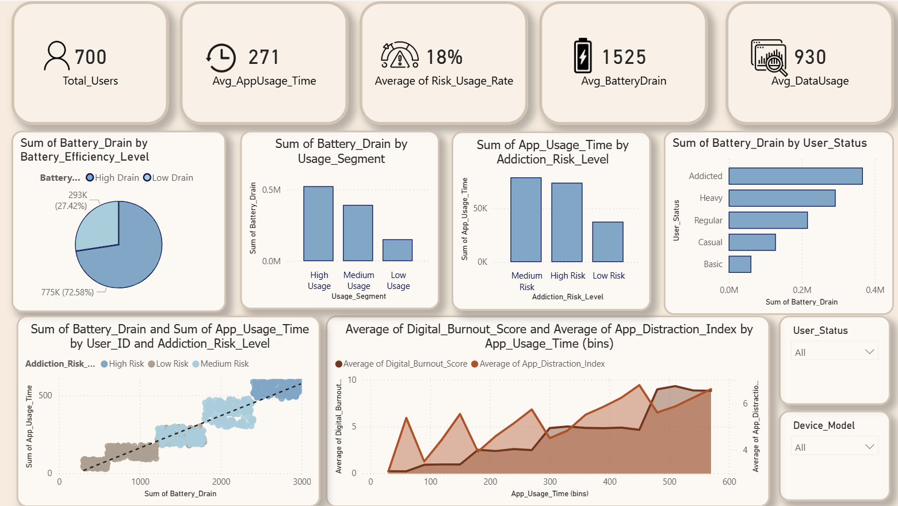

# The Power Drain Effect How User Behavior Impacts Smartphones

  

    This project was developed as a team collaboration focused on analyzing datasets related to mobile user behavior and its impact on smartphone performance, particularly battery efficiency. The project explores factors such as screen time, app usage, charging habits, data consumption, and user activity patterns to identify correlations and behavioral trends affecting battery performance.
  

  

  ___________________________________________________________________________________________________________________________
  

  
  

  Using data analysis and visualization techniques, the team worked together to extract meaningful insights that can contribute to improving battery optimization, enhancing user experience, and supporting smarter mobile device management. The project also strengthened teamwork, problem-solving, and data analysis skills through collaborative research and interpretation of real-world datasets.
  

  

## Interactive Power BI Dashboard:

Click the image below to open the interactive dashboard.

